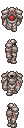

# giftools	
Scripts to manipulate gifs by drag-and-drop in masse	

Requirement: PIL	

## Scaler	

Reduce/Redux/Resample call scale_image.py with fixed parameters. Works on animated gifs.	

### Examples	

reduce D2, D4, D8 divides the size by 2, 4, 8. It uses statistics.mode to determine the output color. Not that good.	

redux nearest 4,8 does the same but uses nearest neighbour (center, one right one bottom) to determine the output color.	

resample X8 multiplies the size by 8. Sharp nearest neighbour.	

## Palette transfer	

generate_palette.py creates a palette.sh file that calls transfer_palette.py with fixed characters. 	

transfer_palette.py copies the palette from the first parameter and applies it on the second parameter. Works on gifs (source), gifs and folders of pngs (target).	

### Example	

 x  = 

## Background changer

Changes the background color to the set color.

## Gif retimer

Changes the framerate of the git to the set miliseconds.