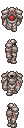

# giftools	
Scripts to manipulate gifs by drag-and-drop in masse	

Requirement: PIL	

Recommended: gifsicle to unoptimize gifs (often source of errors in brute manipulation)

## Scaler	

Reduce/Redux/Resample call scale_image.py with fixed parameters. Works on animated gifs.	

### Examples	

reduce D2, D4, D8 divides the size by 2, 4, 8. It uses statistics.mode to determine the output color. Not that good.	

redux nearest 4,8 does the same but uses nearest neighbour (center, one right one bottom) to determine the output color.	

resample X8 multiplies the size by 8. Sharp nearest neighbour.	

## Palette transfer	

generate_palette.py creates a palette.sh file that calls transfer_palette.py with fixed characters. 	

transfer_palette.py copies the palette from the first parameter and applies it on the second parameter. Works on gifs (source), gifs and folders of pngs (target).	

### Example	

 x  → 

## Background changer

Changes the background color to the set color.

## Gif retimer

Changes the framerate of the git to the set miliseconds.

## Stacker

Stack two or more gifs together, horizontally (default) or vertically.

If the frame amounts are different, it will duplicate them (as long as it's an integer number).

If the sizes are different, different centering methods will be used.

## Rearanger

If the order in which things are stacked is not up to tastes, can easily re-shift the squares by inputing the divisions (width, height) of the source and the result.

>python rearange_gif.py 1 3 3 1 Examples/EarthPrincess.gif

 → 