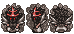

# giftools	
Scripts to manipulate gifs by drag-and-drop in masse

# Explanations for beginners:

Requirements: Python

>https://www.python.org/

PIL, NUMPY for image manipulation

In cmd.exe

    pip install pillow

    pip install numpy

Some bash to launch .sh scripts

>https://gitforwindows.org/

gifsicle to unoptimize gifs (often source of errors in brute manipulation)

>https://www.lcdf.org/gifsicle/

Add gifsicle's folder to your PATH

>https://www.architectryan.com/2018/03/17/add-to-the-path-on-windows-10/

Download this repository (Clone or download → Download zip) and put it somewhere (unzip it). Open the folder and keep it around so that you can drag-and-drop images onto the scripts.

# Scripts and functionalities

*Most of the scripts work with simply drag-and-dropping one or several files on them.*

## Scalers: `reduce/reduc/resample.sh` 

Calling `scale_image.py scaling_factor filename`

    resample\ X4.sh EarthPrincess.gif

 →  

    redux\ nearest\ 4.sh EarthPrincess_X4.gif

 → 

>You can rename the redux/resample/reduce bash files to change their scaling factor.

>You can drag-and drop multiple files on them.

## Palette changer: `transfer_palette.py sourceimage targetimage`

 x  → 

> You can only drop two files on this script

> The second file can be a folder of .png

### Shortcut: `generate_palette.py sourceimage`

Creates a file `sourceimage_palette.sh` on which you can directly drop several images that will all be recolored.

The new script will call `transfer_palette.py sourceimage otherimage`. Good if your images come from different folders!

> You can drag-and drop multiple files on this script.

> You can drag-and drop multiple files, including folders of .pngs on the script generated by this script.

### Shortcut: `DAIN_retrieve_interpolation.sh sourcegif`

This script will retrieve the .pngs in the `sourceimage\interpolated_frames` local folder and stich them into a .gif while using sourceimage as a palette source. Just drag-and-drop the source gif onto the script if it is in the same folder as the folder that DAIN created.

Used when working with folders generated by #DAIN-app.

### Shortcut: `DAIN_retrieve_autopixel4.sh sourcegif`

There exist a variation of `DAIN_retrieve_interpolation` called `DAIN_retrieve_autopixel4.sh` that will automatically pixelise the upscaled output. Great timesaver!

    DAIN_retrieve_autopixel4.sh EarthPrincess_X4.gif

 + DAIN-generated folder =

.gif) →  → 

> You can drag-and drop multiple files on those scripts.

## Background changers: `bg_col r g b.sh`, `bg empty.sh`, `bg fill empty.sh`

Calling `change_background.py r g b filename`

    bg_col\ 255\ 0\ 0.sh march_new.gif

 → 

> You can rename the bg_col rgb files to change the color they apply.

    bg\ empty.sh march_new.gif

 → 

    bg\ fill\ empty.sh march_new.gif

 → 

> You can drag-and drop multiple files on those scripts.

## Gif timing changer: `RETIME miliseconds.sh`

    RETIME 20.sh EarthPrincess.gif
    
 →  

> You can drag-and drop multiple files on those scripts.

> You can copy and rename the RETIME files to change the duration they apply.

## Stacker: `STACK_gifs.py`, `STACK-V gifs.sh`

If the frame amounts are different, it will duplicate them (as long as it's an integer number).

If the sizes are different, different centering methods will be used.

    STACK_gifs.py EarthPrincess.gif gloria_robot.gif
    

 +  =  

    STACK-V gifs.sh EarthPrincess.gif gloria_robot.gif
    

 +  =  

> You have to drop several files on those scripts.

> The order in which they are stacked is: the one you clicked on first, then by folder order.

## Rearanger: `rearange_gif.py dx dy dx2 dy2`

If the order in which things are stacked is not up to tastes, can easily re-shift the squares by inputing the divisions (width, height) of the source and the result.

    rearange_gif.py 1 3 3 1 Examples/PolarBear_A.gif

 → 

> You can copy and edit the separations in the filename to change the way the images are split.

### PS3K spritesheet converter: `spritesheet_to_gif 3x4.py`

Legacy format for a game called Fantasy Online where players could participate in asset-creation.

    spritesheet_to_gif\ 3x4.py PolarBear.png
    
 → 

    